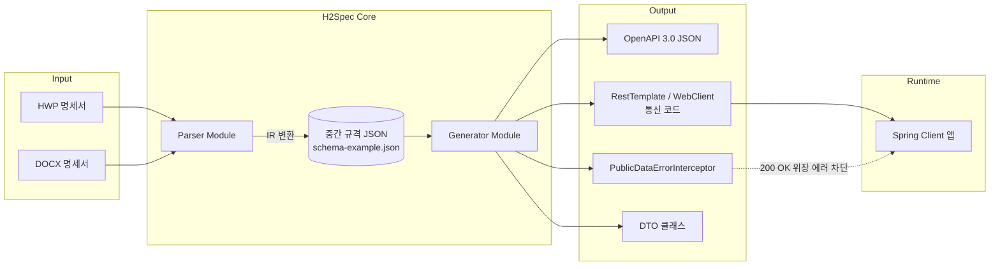

# H2Spec

> **H**WP/docx → **O**pen**API** **Spec** 변환기 (프로젝트명 발음: "에이치투스펙")
> 공공기관의 비표준 API 명세서(HWP/DOCX)를 OpenAPI 3.0 스펙으로 변환하고,
> Spring 통신 코드와 "200 OK 위장 에러" 감지 Interceptor까지 자동 생성하는 오픈소스 도구입니다.

[](./LICENSE)
[](#)
[](#)

## 왜 만들었나

공공데이터포털 및 각 기관 자체 API는 다음 두 가지 문제를 공통적으로 안고 있습니다.

1. **명세서가 표준 포맷이 아님**: Swagger/OpenAPI 대신 HWP나 워드 문서로 파라미터 표가 제공되는 경우가 대부분이라, 매번 사람이 표를 읽고 DTO와 클라이언트 코드를 손으로 작성해야 합니다.
2. **HTTP Status만 믿을 수 없음**: 인증키 오류, 파라미터 오류, 호출 한도 초과 같은 명백한 실패 상황에서도 `200 OK`를 반환하고, 실제 성공/실패는 응답 바디 안의 `resultCode` 같은 필드로만 알려주는 API가 많습니다. 이를 놓치면 실패 응답을 성공으로 처리하는 버그로 이어집니다.

H2Spec은 이 두 문제를 각각 **파서/제너레이터 파이프라인**과 **런타임 Interceptor**로 해결합니다.

## 아키텍처



### 모듈 구성

| 모듈 | 역할 | 팀원 병렬 개발 포인트 |
|---|---|---|
| `parser` | HWP/DOCX를 파싱하여 중간 규격(IR) JSON 생성 | `schema-example.json`을 계약(contract)으로 삼아 Generator와 독립 개발 가능 |
| `generator` | IR JSON → OpenAPI 3.0 JSON, Spring 클라이언트 코드 생성 | 동일하게 IR JSON 샘플만으로 개발 시작 가능 |
| `interceptor-core` | `PublicDataErrorInterceptor`, `PublicDataApiException` 등 런타임 라이브러리 | Parser/Generator와 무관하게 독립 배포 가능 (별도 jar) |
| `web` (선택) | 업로드 → 변환 → 다운로드 웹 UI | REST API 계약만 맞으면 병렬 개발 가능 |

## 빠른 시작

### 1. 명세서 변환

```bash
./h2spec convert \
  --input ./docs/실거래가_API_명세서.hwp \
  --output ./generated \
  --success-code 00
```

### 2. 생성 결과물 예시

```
generated/
├── openapi/RTMSDataSvcAptTradeDev.json
├── client/AptTradeApiClient.java
├── dto/AptTradeItem.java
└── interceptor/PublicDataErrorInterceptor.java   # 미리 정의된 공통 라이브러리 사용 가능
```

### 3. 생성된 클라이언트에 Interceptor 적용

```java
RestTemplate restTemplate = new RestTemplate(
    new BufferingClientHttpRequestFactory(new SimpleClientHttpRequestFactory())
);
restTemplate.getInterceptors().add(new PublicDataErrorInterceptor("00"));
```

> `BufferingClientHttpRequestFactory`로 감싸지 않으면 Interceptor가 바디를 먼저 읽은 뒤
> 후속 메시지 컨버터가 빈 스트림을 읽게 되므로 반드시 함께 사용해야 합니다.

## 중간 규격(IR) 계약

파서와 제너레이터는 서로의 내부 구현을 몰라도 `schema-example.json`에 정의된 구조만 지키면
독립적으로 개발할 수 있습니다. 주요 필드:

- `api.requestParameters[]`: 쿼리/패스 파라미터 목록 (타입, 필수 여부, 예시값)
- `api.responseFields[]`: 응답 필드의 JSONPath/XPath 유사 경로와 타입
- `api.errorSpec`: 성공 코드, resultCode 후보 키, 알려진 에러코드/키워드 목록

이 계약이 바뀌는 경우 PR에 `[BREAKING-IR]` 라벨을 붙이고 두 모듈 담당자 모두의 리뷰를 받아야 합니다.

## 기여 방법

1. 이슈를 먼저 등록해 주세요 (`.github/ISSUE_TEMPLATE/issue-template.md` 사용)
2. 브랜치는 `feature/`, `fix/`, `docs/` 접두사를 사용합니다
3. PR은 `.github/PULL_REQUEST_TEMPLATE/pr-template.md` 양식을 따릅니다
4. IR 스키마를 변경하는 PR은 parser/generator 양쪽 담당자 승인이 필요합니다

## 로드맵

- [ ] HWP 표 파싱 정확도 개선 (병합 셀 대응)
- [ ] WebClient 리액티브 버전 Interceptor(`ExchangeFilterFunction`) 지원
- [ ] 다건 API 배치 변환 CLI 옵션
- [ ] 알려진 공공기관 에러코드 사전(dictionary) 커뮤니티 기여 방식 정립

## 라이선스

이 프로젝트는 [MIT License](./LICENSE)를 따릅니다.

```
MIT License

Copyright (c) 2026 H2Spec Contributors

Permission is hereby granted, free of charge, to any person obtaining a copy
of this software and associated documentation files (the "Software"), to deal
in the Software without restriction, including without limitation the rights
to use, copy, modify, merge, publish, distribute, sublicense, and/or sell
copies of the Software, and to permit persons to whom the Software is
furnished to do so, subject to the following conditions:

The above copyright notice and this permission notice shall be included in all
copies or substantial portions of the Software.

THE SOFTWARE IS PROVIDED "AS IS", WITHOUT WARRANTY OF ANY KIND, EXPRESS OR
IMPLIED, INCLUDING BUT NOT LIMITED TO THE WARRANTIES OF MERCHANTABILITY,
FITNESS FOR A PARTICULAR PURPOSE AND NONINFRINGEMENT. IN NO EVENT SHALL THE
AUTHORS OR COPYRIGHT HOLDERS BE LIABLE FOR ANY CLAIM, DAMAGES OR OTHER
LIABILITY, WHETHER IN AN ACTION OF CONTRACT, TORT OR OTHERWISE, ARISING FROM,
OUT OF OR IN CONNECTION WITH THE SOFTWARE OR THE USE OR OTHER DEALINGS IN THE
SOFTWARE.
```
