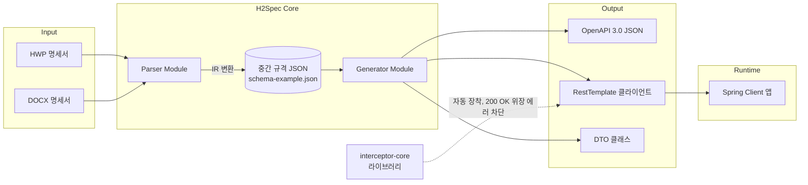

# H2Spec (HWP to Spring-Client)

> **H**WP/docx → **O**pen**API** **Spec** 변환기
> 공공기관의 비표준 API 명세서(HWP/HWPX/DOCX)를 OpenAPI 3.0 스펙으로 변환하고,
> Spring 통신 코드와 "200 OK 위장 에러" 감지 Interceptor까지 자동 생성하는 오픈소스 도구입니다.

[](https://github.com/junu0305/H2Spec/actions/workflows/build.yml)
[](./LICENSE)
[](#)
[](#)

## 🎯 개발 목적
비표준 HWP 명세서로 제공되는 국내 공공데이터 API를 활용할 때 발생하는 개발 비효율을 근본적으로 해결하고자 합니다. 
문서 수동 분석과 클라이언트 코드 구축의 번거로움을 제거하고, 오류임에도 200 OK를 반환하는 비표준 응답 예외 처리까지 자동화된 Spring 클라이언트 생성 라이브러리를 통해 공공데이터의 활용 장벽을 대폭 낮추고자 합니다.

## 🚀 기대 효과
* **개발 생산성 극대화 및 리소스 절감**: 수작업 분석 및 보일러플레이트 코드 작성을 자동화하여 초기 연동 시간을 90% 이상 단축합니다.
* **시스템 안정성 확보**: 성공(200 OK) 코스프레형 에러 응답을 식별하는 인터셉터를 내장하여 장애를 원천 차단합니다.
* **표준 기술 생태계 기여**: 비표준 문서를 글로벌 표준 포맷(OpenAPI Spec)으로 전환하는 징검다리 역할을 수행합니다.

## 왜 만들었나

공공데이터포털 및 각 기관 자체 API는 다음 두 가지 문제를 공통적으로 안고 있습니다.

1. **명세서가 표준 포맷이 아님**: Swagger/OpenAPI 대신 HWP나 워드 문서로 파라미터 표가 제공되는 경우가 대부분이라, 매번 사람이 표를 읽고 DTO와 클라이언트 코드를 손으로 작성해야 합니다.
2. **HTTP Status만 믿을 수 없음**: 인증키 오류, 파라미터 오류, 호출 한도 초과 같은 명백한 실패 상황에서도 `200 OK`를 반환하고, 실제 성공/실패는 응답 바디 안의 `resultCode` 같은 필드로만 알려주는 API가 많습니다. 이를 놓치면 실패 응답을 성공으로 처리하는 버그로 이어집니다.

H2Spec은 이 두 문제를 각각 **파서/제너레이터 파이프라인**과 **런타임 Interceptor**로 해결합니다.

## 아키텍처



### 모듈 구성

| 모듈 | 역할 | 팀원 병렬 개발 포인트 |
|---|---|---|
| `parser` | 공공데이터포털 표준 기술문서(DOCX/HWP/HWPX)를 파싱하여 중간 규격(IR) JSON 생성 | `schema-example.json`을 계약(contract)으로 삼아 Generator와 독립 개발 가능 |
| `generator` | IR JSON → OpenAPI 3.0 JSON, Spring 클라이언트 코드, DTO 생성 | 동일하게 IR JSON 샘플만으로 개발 시작 가능 |
| `interceptor-core` | `PublicDataErrorInterceptor`(RestTemplate), `PublicDataErrorFilter`(WebClient), `PublicDataApiException` 등 런타임 라이브러리 | Parser/Generator와 무관하게 독립 배포 가능 (별도 jar) |
| `cli` | `h2spec convert` 명령 — parser와 generator를 잇는 진입점 | |
| `web` (선택) | 업로드 → 변환 → 다운로드 웹 UI | REST API 계약만 맞으면 병렬 개발 가능 |

## 빠른 시작

### 1. 명세서 변환

```bash
./h2spec convert \
  --input "docs/sample/한국환경공단_에어코리아_측정소정보_기술문서_v1.2.docx" \
  --output ./generated
```

```
IR 추출: generated/ir/MsrstnList.json
생성: generated/kr/go/h2spec/client/msrstnlist/dto/MsrstnListResponse.java
생성: generated/kr/go/h2spec/client/msrstnlist/MsrstnListClient.java
생성: generated/openapi/MsrstnList.json
...(문서의 상세기능마다 반복)
```

HWP 명세서(`.hwp`), HWPX 명세서(`.hwpx`), IR JSON도 같은 방식으로 넣을 수 있습니다.

```bash
./h2spec convert --input "명세서.hwp" --output ./generated
./h2spec convert --input docs/schema-example.json --output ./generated
```

`--input`에 디렉터리를 주면 그 안의 모든 명세 파일(`.docx`, `.hwp`, IR `.json`)을 한 번에 변환합니다.
디렉터리를 재귀적으로 탐색하지는 않고, 명세 파일이 아닌 다른 파일(예: pdf, xlsx)은 무시합니다.
일부 파일이 변환에 실패해도 나머지 파일은 계속 변환되며, 실패가 하나라도 있으면 종료 코드는 1입니다.

```bash
./h2spec convert --input ./docs/sample --output ./generated
```

### 옵션

| 옵션 | 설명 |
|---|---|
| `-i`, `--input` | 명세 파일(DOCX/HWP/HWPX/IR JSON) 또는 명세 파일들이 담긴 디렉터리 |
| `-o`, `--output` | 출력 디렉터리 (기본: `./generated`) |
| `--package` | 생성 코드의 기준 패키지. 오퍼레이션별 하위 패키지가 자동으로 붙습니다 |
| `--format` | 응답 포맷 `xml` 또는 `json`. 문서에서 판별한 값을 덮어씁니다 |
| `--success-code` | 정상 처리로 간주할 `resultCode` (기본: 문서의 값 또는 `00`) |

```bash
./h2spec convert --input ./docs/sample --output ./generated \
  --package com.example.publicdata --format json
```

### 2. 생성 결과물

```
generated/
├── ir/MsrstnList.json              # 추출된 중간 표현(IR) — 검수·수정 후 재입력 가능
├── openapi/MsrstnList.json         # OpenAPI 3.0 문서 — Swagger UI/Postman에서 바로 사용
└── kr/go/h2spec/client/msrstnlist/
    ├── MsrstnListClient.java       # RestTemplate 클라이언트
    └── dto/MsrstnListResponse.java # Jackson XML 매핑 DTO
```

### 3. 생성된 클라이언트 사용

```java
MsrstnListClient client = new MsrstnListClient("발급받은 서비스키");
MsrstnListResponse response = client.getMsrstnList("xml", 10, 1, "서울", null);
```

생성된 클라이언트에는 `PublicDataErrorInterceptor`가 **자동 장착**되어 있어 별도 설정이 필요 없습니다.
인증키 오류·호출 한도 초과처럼 HTTP 200 OK로 위장한 에러 응답이 오면 `PublicDataApiException`을 던집니다.

### 인터셉터만 단독으로 사용하기

직접 구성한 RestTemplate에도 붙일 수 있습니다 (`interceptor-core` 모듈):

```java
RestTemplate restTemplate = new RestTemplate(
    new BufferingClientHttpRequestFactory(new SimpleClientHttpRequestFactory())
);
restTemplate.getInterceptors().add(new PublicDataErrorInterceptor("00"));
```

> `BufferingClientHttpRequestFactory`로 감싸지 않으면 Interceptor가 바디를 먼저 읽은 뒤
> 후속 메시지 컨버터가 빈 스트림을 읽게 되므로 반드시 함께 사용해야 합니다.

WebClient에는 `ExchangeFilterFunction` 구현체를 붙일 수 있습니다. 필터가 읽은 응답 바디는
downstream에서 다시 읽을 수 있도록 복원됩니다. 필터 자체는 기본 256KB 코덱 제한을
사용하지 않지만, 이후 `bodyToMono(String.class)` 또는 DTO 디코딩을 할 때는 WebFlux
코덱의 기본 메모리 제한이 적용되므로 큰 응답에는 제한을 늘려야 합니다.

```java
WebClient webClient = WebClient.builder()
    .filter(new PublicDataErrorFilter("00"))
    .codecs(c -> c.defaultCodecs().maxInMemorySize(5 * 1024 * 1024))
    .build();
```

### 에러코드 사전

예외 메시지에는 결과코드의 뜻과 조치 안내가 함께 붙습니다.

```
[H2Spec] 공공데이터 API 응답 오류 감지 (HTTP 403 이지만 실제로는 실패) - uri=...&serviceKey=****,
resultCode=30, resultMsg=SERVICE_KEY_IS_NOT_REGISTERED_ERROR | 등록되지 않은 서비스키
| 조치: 인증키를 확인한다. Encoding/Decoding 키를 바꿔 넣었거나, 신청 직후라 아직 반영되지 않은 경우가 많다.
```

사전에 없는 코드를 만났다면 항목을 추가해 주세요. 형식과 등재 기준은 [docs/error-codes.md](./docs/error-codes.md)에 있습니다.

### 빠른 시작

저장소를 클론하지 않고 씁니다. Java 17 이상이 필요합니다.

**1. 변환 도구 받기**

```bash
curl -sL -o h2spec.zip https://github.com/junu0305/H2Spec/releases/download/v0.1.0/h2spec-v0.1.0.zip
unzip h2spec.zip
```

**2. 명세서 변환**

```bash
./h2spec-v0.1.0/bin/h2spec convert \
    --input 기술문서.docx \
    --output generated \
    --package com.mycorp.publicdata
```

`generated/` 아래에 클라이언트와 DTO가 패키지 경로대로, OpenAPI 스펙이 `openapi/`에 나옵니다.

**3. 프로젝트에 붙이기**

```groovy
repositories {
    mavenCentral()
    maven { url 'https://jitpack.io' }
}

dependencies {
    implementation 'com.github.junu0305.H2Spec:interceptor-core:v0.1.0'

    // XML 응답 API일 때만 추가합니다
    implementation 'com.fasterxml.jackson.dataformat:jackson-dataformat-xml:2.17.1'
}

sourceSets.main.java.srcDir 'generated'
```

**4. 호출**

```java
MsrstnListClient client = new MsrstnListClient(serviceKey);
MsrstnListResponse res = client.getMsrstnList(2L, 1L, null, null);
```

인증키는 생성자에서 받으므로 메서드마다 넘기지 않습니다.
HTTP 200으로 위장한 실패 응답은 `PublicDataApiException`으로 올라옵니다.

### 내 프로젝트에서 쓰기

생성된 클라이언트는 `interceptor-core`를 의존성으로 요구합니다. JitPack에서 받습니다.

```groovy
repositories {
    mavenCentral()
    maven { url 'https://jitpack.io' }
}

dependencies {
    implementation 'com.github.junu0305.H2Spec:interceptor-core:v0.1.0'

    // XML 응답 API일 때만 추가합니다. 생성된 DTO가 @JacksonXmlProperty를 씁니다.
    implementation 'com.fasterxml.jackson.dataformat:jackson-dataformat-xml:2.17.1'
}
```

`spring-web`과 `jackson-databind`는 `interceptor-core`가 `api`로 노출하므로 따로 선언하지 않아도 됩니다.

로컬에서 고쳐가며 쓰려면 `~/.m2`에 올립니다.

```bash
./gradlew publishToMavenLocal
```

```groovy
repositories { mavenLocal(); mavenCentral() }

dependencies {
    implementation 'kr.go.h2spec:interceptor-core:0.1.0-SNAPSHOT'
}
```

원격 저장소에 올리려면 URL과 인증 정보를 넘깁니다.

```bash
./gradlew publish \
    -Ph2specRepoUrl=https://... \
    -Ph2specRepoUser=... \
    -Ph2specRepoPassword=...
```

게시하지 않고 소스에서 바로 쓰려면 composite build로 끌어옵니다.

```groovy
// settings.gradle
includeBuild('/path/to/H2Spec') {
    name = 'h2spec'   // 디렉터리명이 H2Spec이라 못 박아야 합니다
}
```

변환을 빌드 단계로 넣으면 명세서가 바뀔 때만 다시 생성됩니다.

```groovy
def generatedDir = layout.buildDirectory.dir('generated/h2spec')

def generateClients = tasks.register('generateClients', Exec) {
    dependsOn gradle.includedBuild('h2spec').task(':cli:installDist')
    inputs.dir 'specs'
    outputs.dir generatedDir
    commandLine '/path/to/H2Spec/cli/build/install/h2spec/bin/h2spec',
            'convert', '--input', file('specs').absolutePath,
            '--output', generatedDir.get().asFile.absolutePath,
            '--package', 'com.example.publicdata'
}

sourceSets.main.java.srcDir generatedDir
tasks.named('compileJava') { dependsOn generateClients }
```

### 빌드와 테스트

빌드에는 JDK 17 이상이 필요합니다. Gradle 실행에 쓰는 JDK와 무관하게 컴파일은 toolchain 설정에 따라
항상 Java 17로 수행되며, 로컬에 JDK 17이 없으면 Gradle이 자동으로 내려받습니다.

```bash
./gradlew build   # 전 모듈 빌드 + 테스트
./gradlew test    # 테스트만
```

## 중간 규격(IR) 계약

파서와 제너레이터는 서로의 내부 구현을 몰라도 `schema-example.json`에 정의된 구조만 지키면
독립적으로 개발할 수 있습니다. 주요 필드:

- `api.requestParameters[]`: 쿼리/패스 파라미터 목록 (타입, 필수 여부, 예시값)
- `api.responseFields[]`: 응답 필드의 JSONPath/XPath 유사 경로와 타입
- `api.errorSpec`: 성공 코드, resultCode 후보 키, 알려진 에러코드/키워드 목록

이 계약이 바뀌는 경우 PR에 `[BREAKING-IR]` 라벨을 붙이고 두 모듈 담당자 모두의 리뷰를 받아야 합니다.

## Git 컨벤션

### 브랜치 구조

모든 작업 브랜치는 `main`에서 분기하고, PR을 통해 다시 `main`으로 머지합니다.
브랜치 prefix는 **PascalCase**(앞글자 대문자)로 통일합니다.

```
main              ← 최종 병합 (PR 필수)
 ├── Feat/*       ← 새 기능
 ├── Fix/*        ← 버그 수정
 ├── Hotfix/*     ← 긴급 수정
 ├── Refactor/*   ← 리팩토링
 ├── Docs/*       ← 문서
 └── Chore/*      ← 빌드/설정
```

| 작업 종류 | 브랜치 이름 예시 |
|---|---|
| 새 기능 | `Feat/generator-dto`, `Feat/parser-docx` |
| 버그 수정 | `Fix/xml-parse-error` |
| 긴급 수정 | `Hotfix/build-error` |
| 리팩토링 | `Refactor/interceptor-core` |
| 문서 | `Docs/readme-update` |
| 빌드/설정 | `Chore/gradle-setup` |

### 커밋 메시지

커밋은 `타입: 내용` 형식의 소문자 prefix를 사용합니다 (Conventional Commits 스타일).

| 타입 | 용도 |
|---|---|
| `feat` | 새로운 기능 추가 |
| `fix` | 버그 수정 |
| `hotfix` | 긴급 수정 |
| `docs` | 문서 수정 |
| `style` | 코드 포맷팅 (기능 변경 없음) |
| `refactor` | 코드 리팩토링 |
| `test` | 테스트 코드 추가 |
| `chore` | 빌드/설정 변경 |

## 기여 방법

1. 이슈를 먼저 등록해 주세요 (`.github/ISSUE_TEMPLATE/issue-template.md` 사용)
2. 브랜치와 커밋 메시지는 위 [Git 컨벤션](#git-컨벤션)을 따릅니다
3. PR은 `.github/pull_request_template.md` 양식을 따릅니다 (PR 생성 시 자동 적용)
4. IR 스키마를 변경하는 PR은 parser/generator 양쪽 담당자 승인이 필요합니다

## 로드맵

- [x] HWP 명세서 파싱 (`hwplib` 기반, 구형 바이너리 `.hwp`)
- [x] WebClient 리액티브 버전 Interceptor(`ExchangeFilterFunction`) 지원
- [x] 다건 API 배치 변환 CLI 옵션
- [x] 생성 코드 패키지 지정 옵션(`--package`), 응답 포맷 지정(`--format`)
- [x] HWP 표 파싱 정확도 개선 (머리행 기준 열 매핑, 병합 셀 대응)
- [x] HWPX(신형식, OWPML) 파싱 지원 (`hwpxlib` 기반)
- [x] 알려진 공공기관 에러코드 사전(dictionary) 커뮤니티 기여 방식 정립

## 라이선스

이 프로젝트는 [MIT License](./LICENSE)를 따릅니다.
